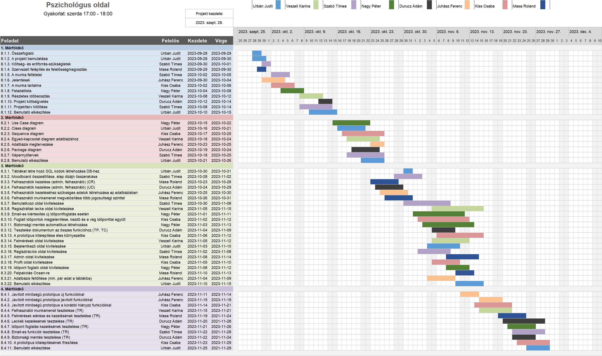

# `Pszichológus oldal` Projektterv `2023/24`

## 1. Összefoglaló 

`Egy pszichológus honlapjának elkészítése jelen projektünk fókusza. Az oldal célja, hogy lehetővé tegye a pszichológus számára, hogy bemutassa magát és szakmai munkásságát az online közönség előtt. Az oldalon bemutatjuk a pszichológus szakmai hátterét, képesítéseit, és tapasztalatait, hogy bizalmat építsünk a látogatókban. Emellett részletesen ismertetjük a pszichológiai szolgáltatásokat, amelyeket nyújt, és segítünk a potenciális pácienseknek megtalálni a számukra megfelelő terápiás lehetőségeket. Az oldal egyszerű, letisztult design-t kap, hogy könnyen áttekinthető legyen, és könnyen navigálható legyen a látogatók számára. Emellett fontos része lesz az oldalnak egy kapcsolatfelvételi űrlap is, amely lehetővé teszi a látogatók számára, hogy egyszerűen felvegyék a kapcsolatot a pszichológussal és időpontot kérjenek.`


## 2. A projekt bemutatása

`Ez a projektterv a Pszichológus munkásságát elősegitő projektet mutatja be, amely 2023-09-23-től 2023-11-22-ig tart, azaz összesen 61 napon keresztül fog futni. A projekten nyolc fejlesztő fog dolgozni, az elvégzett feladatokat pedig négy alkalommal fogjuk prezentálni a megrendelőnek, annak érdekében, hogy biztosítsuk a projekt folyamatos előrehaladását.`


### 2.1. Rendszerspecifikáció

`A megrendelő, fő igénye az, hogy hatékonyan tudja bemutatni magát és munkásságát az online térben, valamint lehetőséget kapjon az időpontok hatékony kezelésére. A felhasználók számára pedig fontos, hogy könnyen megtalálják a pszichológus szolgáltatásait, és egyszerűen tudjanak időpontot foglalni vagy kapcsolatba lépni vele az oldalon keresztül. A rendszer az adminisztratív feladatok egyszerűsítése és a felhasználói élmény javítása mellett segíti a pszichológust abban, hogy sikeresen kommunikáljon az online közönséggel. A projekt fő célja egy olyan weboldal létrehozása, amely lehetővé teszi egy pszichológus számára, hogy hatékonyan mutassa be magát és szolgáltatásait az online térben. A rendszer lehetőséget biztosít a pszichológusnak saját cikkek publikálására, amelyek segítik az információ megosztását és az online jelenlét erősítését. Emellett a felhasználók regisztrálhatnak az oldalon, és a regisztrált felhasználók időpontot is foglalhatnak a pszichológus szolgáltatásaira, így egyszerűsítve az időpontok koordinálását. Az adminisztrátori felület segítségével könnyen kezelheti a megrendelő az oldal tartalmát és az időpontok elérhetőségét.`


### 2.2. Funkcionális követelmények

 - `Felhasználók kezelése (admin, felhasználó) (CRUD)`
 - `Felhasználói munkamenet megvalósítása több jogosultsági szinttel `
 - `Időpont foglalások kezelése (CRUD)`
 - `Cikkek kezelése (CRUD)`
 - `Email-es kiértesítés új idópont foglalás esetén az adott személynek és a pszichológusnak`


### 2.3. Nem funkcionális követelmények

 - `A kliens oldal böngészőfüggetlen legyen`
 - `Reszponzív megjelenés`
 - `Az érzékeny adatokat biztonságosan tároljuk`
 - `A legfrissebb technológiákat használja a rendszer`


## 3. Költség- és erőforrás-szükségletek

Az erőforrásigényünk összesen `1260` személynap, átlagosan `20` személynap/fő.

A rendelkezésünkre áll összesen `8 * 70 = 560` pont.


## 4. Szervezeti felépítés és felelősségmegosztás

A projekt megrendelője `Urbán Csilla PHD hallgató`. A `Pszichológus oldal` projektet a projektcsapat fogja végrehajtani, amely `jelenleg nyolc fejlesztőből áll. A csapatban található többé és kevésbé tapasztalt webprogramozó is.`
 - `Urbán Judit (<1 év tapasztalat)`
 - `Szabó Tímea (<1 év tapasztalat)`
 - `Nagy Péter  (<1 év tapasztalat)`
 - `Durucz Ádám  (<1 év tapasztalat)`
 - `Veszeli Karina  (<1 év tapasztalat)`
 - `Kiss Csaba  (<1 év tapasztalat)`
 - `Masa Roland  (<1 év tapasztalat)`
 - `Juhász Ferenc  (3 év tapasztalat)`

```
Itt lehet részletezni pl. a tagok szakmai tapasztalatait, vagy akár a releváns gyakorlati helyeket, munkahelyeket megemlíteni.
```

### 4.1 Projektcsapat

A projekt a következő emberekből áll:

| Név          | Pozíció          |   E-mail cím (stud-os)        |
|--------------|------------------|-------------------------------|
| `Urbán Judit` | Projektmenedzser | `h165835@stud.u-szeged.hu`    |
| `Szabó Tímea` | Projekt tag      | `h164242@stud.u-szeged.hu`    |
| `Nagy Péter`  | Projekt tag      | `h879771@stud.u-szeged.hu`    |
| `Durucz Ádám` | Projekt tag      | `h155067@stud.u-szeged.hu`    |
|`Veszeli Karina`| Projekt tag      | `h166120@stud.u-szeged.hu`    |
|`Kiss Csaba` | Projekt tag      | `h264781@stud.u-szeged.hu`    |
|`Masa Roland` | Projekt tag      | `h267480@stud.u-szeged.hu`    |
|`Juhász Ferenc` | Projekt tag      | `h983413@stud.u-szeged.hu`    |

```
Betölthető pozíciók: projektmenedzser, projekt tag.
```

## 5. A munka feltételei

### 5.1. Munkakörnyezet

 - `Munkaállomások: 8 db, Windows 10-es operációs rendszerrel`

 - `Acer laptop (CPU:  i3-1115G4 , RAM: 4GB, GPU: )`

 - `HP EliteBook (CPU: i7-3740QM, RAM: 14 GB, GPU: NVIDIA Quadro)`

 - `Asus Zenbook 14x OLED (CPU: AMD Ryzen 5 5600H, RAM: 16 GB, GPU: AMD Radeon Graphics)`

 - `MacBook Pro (CPU: Apple M1, RAM: 16 GB, GPU: Apple M1 integrált grafikus processzor)`

 - `Asus ViVoBook 15 (CPU: Intel(R) Core(TM) i7-1165G7 , RAM: 8 GB, GPU:Intel Iris Xe Graphics)`
 
 - `MacBook Pro (CPU: Apple M1, RAM: 16 GB, GPU: Apple M1 integrált grafikus processzor)`

 - `Asztali gép (CPU: Ryzen 5 5600, RAM: 16 GB, GPU: GTX 1650 Super)`
 
 - `Asus TUF Gaming FX505 (CPU: AMD Ryzen 7 3750H with Radeon Vega Mobile Gfx 2.30 GHz , RAM: 8 GB, GPU: GTX 1660 TI)`
 

A projekt a következő technológiákat/szoftvereket fogja használni a munka során: 

 - `Node.js szerverkörnyezet a webalkalmazás futtatásához`
 - `MongoDB adatbázis adataink tárolásáho`
 - `Express.js webes alkalmazáskeret a szerver oldali fejlesztéshez`
 - `React JavaScript könyvtár a felhasználói felület készítéséhez`
 - `npm szoftvercsomag menedzser a projekt függőségeinek kezeléséhez`
 - `Visual Studio Code IDE fejlesztőkörnyezet`
 - `Git verziókövető rendszer (GitLab)`
 
```
Milyen gépet használnak a projekttagok, milyen operációs rendszeren fejlesztenek, milyen szoftverkörnyezetben, stb.
```

### 5.2. Rizikómenedzsment

| Kockázat                                    | Leírás                                                                                                                                                                                     | Valószínűség | Hatás  |
|---------------------------------------------|--------------------------------------------------------------------------------------------------------------------------------------------------------------------------------------------|--------------|--------|
| `Betegség`                                  | `Súlyosságtól függően hátráltatja vagy bizonyos esetekben teljes mértékben korlátozza a munkavégzőt, így az egész projektre kihatással van. Megoldás: a feladatok átcsoportosítása`        | `nagy`       | `erős` |
| `Kommunikációs fennakadás a csapattagokkal` | `A csapattagok között nem elégséges az információ áramlás, nem pontosan, esetleg késve vagy nem egyértelműen tájékoztatjuk egymást. Megoldás: még gyakoribb megbeszélések és ellenőrzések` | `kis`        | `erős` |
| `ZH időszak` | `A csapattagok közül egy vagy több embernek is húzos hete van, amikor nem tud olyan szinten részt venni a projektben, mint egyébként. Megoldás: ha pár órát is, de igyekszünk foglalkozni a feladattal` | `nagy`        | `közepes` |
| `Internet kimaradás` | `A csapaton belül lehetnek olyanok, akiknél gyakoribb az internet kimaradása. Megoldás: nagyobb kimaradás esetén publikus internettel rendelkező helyen dolgozunk` | `kis`        | `elhanyagolható` |

```
A rizikótényezők bemutatása, amely hátráltathatja a projekt befejezését. 
Minden rizikót érdemes megemlíteni, részletezve, hogy mit jelent, 
milyen valószínűséggel következhet be (kis, közepes és nagy), 
mekkora a várható hatása (gyenge, közepes és erős) 
és hogy milyen tervvel készültök, amennyiben egy ilyen esemény bekövetkezik. 
Pl.: betegség, szoftver-hardver probléma, tag kiesése, extrém ZH időszak, pandémia, stb. 
```

## 6. Jelentések

### 6.1. Munka menedzsment
A munkát `Urbán Judit` koordinálja. `Fő feladata, hogy folyamatosan egyeztessen a csapattagokkal az előrehaladásról és a fellépő problémákról. További feladata a heti szinten tartandó csoportgyűlések időpontjának és helyszínének leszervezése, erről messenger csoportban diskurál a projektcsapat.`

```
Írd le, hogy ki menedzseli a munkát (tipikusan a projekt menedzser), mik a feladatai, és azokat hogyan hajtja végre.
```

### 6.2. Csoportgyűlések

`A csapat rendszeresen összeül, hogy elősegítse a projekt haladását és biztosítsa a gördülékeny kommunikációt. Az üléseken áttekintik az elmúlt hét kihívásait és megtervezik a következő heti feladatokat, melyről minden alkalommal készül egy rövid memó.`

`1. megbeszélés:`
 - `Időpont: 2021.10.05.`
 - `Hely: Nyugi Kert - Szeged, Vitéz u. 28.`
 - `Résztvevők: Urbán Judit, Veszeli Karina, Szabó Tímea, Nagy Péter, Durucz Ádám, Juhász Ferenc, Kiss Csaba, Masa Roland`
 - `Érintett témák: Ismerkedés, projekttéma kiválasztása, főbb feladatok meghatározása`
 - `Tartalma: A megbeszélés elején lehetőséget biztosítottunk minden résztvevő számára, hogy bemutatkozzon és ismertesse saját háttértudását, mely a projekt során hasznosítható. Ezt követően konszenzus alapján meghatároztuk a megvalósítandó programot, valamint nagyvonalakban körvonalaztuk annak specifikációját és a követelményeket. Ezenfelül rögzítettük a projekt során elvégzendő főbb feladatokat, és tisztáztuk, kik vesznek részt az egyes fázisokban.`


### 6.3. Minőségbiztosítás

Az elkészült terveket a terveken nem dolgozó csapattársak közül átnézik, hogy megfelel-e a specifikációnak és az egyes diagramtípusok összhangban vannak-e egymással. A meglévő rendszerünk helyes működését a prototípusok bemutatása előtt a tesztelési dokumentumban leírtak végrehajtása alapján ellenőrizzük és összevetjük a specifikációval, hogy az elvárt eredményt kapjuk-e. További tesztelési lehetőségek: unit tesztek írása az egyes modulokhoz vagy a kód közös átnézése (code review) egy, a vizsgált modul programozásában nem résztvevő csapattaggal. Szoftverünk minőségét a végső leadás előtt javítani kell a rendszerünkre lefuttatott kódelemzés során kapott metrikaértékek és szabálysértések figyelembevételével.
Az alábbi lehetőségek vannak a szoftver megfelelő minőségének biztosítására:
- Specifikáció és tervek átnézése (kötelező)
- Teszttervek végrehajtása (kötelező)
- Unit tesztek írása (választható)
- Kód átnézése (választható)

### 6.4. Átadás, eredmények elfogadása

A projekt eredményeit a gyakorlatvezető, `Dr. Pflanzner Tamás` fogja elfogadni. A projektterven változásokat csak a gyakorlatvezető írásos engedélyével lehet tenni. A projekt eredményesnek bizonyul, ha specifikáció helyes és határidőn belül készül el. Az esetleges késések pontlevonást eredményeznek. 
Az elfogadás feltételeire és beadás formájára vonatkozó részletes leírás a következő honlapon olvasható: https://okt.inf.szte.hu/rf1/

### 6.5. Státuszjelentés

Minden mérföldkő leadásnál a projekten dolgozók jelentést tesznek a mérföldkőben végzett munkájukról a a megadott sablon alapján. A gyakorlatvezetővel folytatott csapatmegbeszéléseken a csapat áttekintik és felmérik az eredményeket és teendőket. Továbbá gazdálkodnak az erőforrásokkal és szükség esetén a megrendelővel egyeztetnek a projektterv módosításáról.

## 7. A munka tartalma

### 7.1. Tervezett szoftverfolyamat modell és architektúra

`A pszichológus weboldal fejlesztése során az "agilis fejlesztési modellt" választottuk, mivel ennek a módszertannak előnyei segítenek a folyamatos fejlesztésben és az ügyfél igényeinek való megfelelésben. Az agilis megközelítés lehetővé teszi a projekt rugalmas módosítását és a gyors reagálást az új elvárásokra. Az agilis módszerrel rendszeresen kommunikálunk az ügyféllel, hogy biztosítsuk az igényeik megértését és a folyamatos visszajelzések beépítését a fejlesztésbe.`

`A webalkalmazás elkészítéséhez a "Model-View-Controller (MVC)" architektúrát alkalmazzuk. Ebben az architektúrában a szerver- és kliensoldal függetlenek egymástól, és csak API végpontok segítségével kommunikálnak egymással. Ez a megközelítés lehetővé teszi a funkcionalitás jól elkülönített és moduláris felépítését, amely segít a fejlesztőknek hatékonyan dolgozni a projekt különböző részein.`

`Az MVC struktúrában a "Model" rész tartalmazza az alkalmazás üzleti logikáját és az adatkezelést. A "View" rész felelős a felhasználói felület megjelenítéséért, míg a "Controller" rész irányítja a kérések feldolgozását és az adatok továbbítását a megfelelő helyre.`

`Ezenkívül a rugalmas specifikációk és az agilis fejlesztési megközelítés segít abban, hogy könnyen alkalmazkodjunk az új elvárásokhoz és a vevői visszajelzésekhez a pszichológus weboldal projektjének keretében.`

```
Milyen szoftverfolyamat modellt követve állítja elő a csapat a specifikációnak megfelelő prototípusokat? Miért ezt választja? 
A csapat milyen architektúrát választ a projekt megvalósításához? Milyen rétegek (logikai, adat, GUI) lesznek?`
```

### 7.2. Átadandók és határidők

A főbb átadandók és határidők a projekt időtartama alatt a következők:


| Szállítandó |                 Neve                                                        |   Határideje  |
|:-----------:|:---------------------------------------------------------------------------:|:-------------:|
|      D1     |      Projektterv és Gantt diagram, prezentáció, egyéni jelentés               | `2023-10-11`  |
|    P1+D2    |      UML, adatbázis- és képernyőtervek, prezentáció, egyéni jelentés        | `2023-10-25`  |
|    P1+D3    |      Prototípus I. és tesztelési dokumentáció, egyéni jelentés              | `2023-11-15`  |
|    P2+D4    |      Prototípus II. és frissített tesztelési dokumentáció, egyéni jelentés  | `2023-12-06`  |

```
D - dokumentáció, P - prototípus
```

## 8. Feladatlista

A következőkben a tervezett feladatok részletes összefoglalása található.

```
Alapvetően egy feladatnak 1 felelőse lehet, de kivételt képez pl. a 9.1.1. részfeladat, mivel az első mérföldkőben
2 kötelező feladat van, ezt nem bontjuk részfeladatokra.
```

### 8.1. Projektterv (1. mérföldkő)

Ennek a feladatnak az a célja, hogy `megvalósításhoz szükséges lépéseket, az erőforrásigényeket, az ütemezést, a felelősöket és a feladatok sorrendjét meghatározzuk, majd vizualizáljuk Gantt diagram segítségével.`

Részfeladatai a következők:

#### 8.1.1. Projektterv kitöltése

Felelős: `Mindenki`

Tartam:  `5 nap`

Erőforrásigény:  `2 személynap/fő`


#### 8.1.2. Bemutató elkészítése

Felelős: `Urbán Judit`

Tartam:  `5 nap`

Erőforrásigény:  `1 személynap`

```
A mérföldkőhöz tartozó feladatok bemutatása PPT keretében, pl. téma, tervezett funkciók, tagok, Gantt diagram.`
```

### 8.2. UML és adatbázis- és képernyőtervek (2. mérföldkő)

Ennek a feladatnak az a célja, hogy `a rendszerarchitektúrát, az adatbázist és webalkalmazás kinézetét megtervezzük.`

Részfeladatai a következők:

#### 8.2.1. Use Case diagram

Felelős: `Nagy Péter`

Tartam:  `8 nap`

Erőforrásigény:  `3 személynap`

#### 8.2.2. Class diagram

Felelős: `Urbán Judit`

Tartam:  `5 nap`

Erőforrásigény:  `0.5 személynap`

#### 8.2.3. Sequence diagram

Felelős: `Durucz Ádám`

Tartam:  `5 nap`

Erőforrásigény:  `2 személynap`

#### 8.2.4. Egyed-kapcsolat diagram adatbázishoz

Felelős: `Veszeli Karina`

Tartam:  `6 nap`

Erőforrásigény:  `3 személynap`

#### 8.2.5. Package diagram

Felelős: `Durucz Ádám`

Tartam:  `5 nap`

Erőforrásigény:  `0.5 személynap`

#### 8.2.6. Képernyőtervek

Felelős: `Szabó Tímea`

Tartam:  `8 nap`

Erőforrásigény:  `0.5 személynap`

#### 8.2.7. Bemutató elkészítése

Felelős: `Urbán Judit`

Tartam:  `5 nap`

Erőforrásigény:  `1 személynap`

```
A mérföldkőhöz tartozó feladatok bemutatása PPT keretében (elkészült diagramok és képernyőtervek)`
```

### 8.3. Prototípus I. (3. mérföldkő)

Ennek a feladatnak az a célja, hogy `egy működő prototípust hozzunk létre, ahol a vállalt funkcionális követelmények nagy része már prezentálható állapotban van.` 

Részfeladatai a következők:

#### `8.3.1. Felhasználók kezelése (admin, felhasználó) (CR)`

Felelős: `Masa Roland`

Tartam:  `6 nap`

Erőforrásigény:  `2 személynap`

#### `8.3.2. Felhasználók kezelése (admin, felhasználó) (UD)`

Felelős: `Durucz Ádám`

Tartam:  `6 nap`

Erőforrásigény:  `2 személynap`

#### `8.3.3. Felhasználók kezeléséhez szükséges adatok létrehozása az adatbázisban`

Felelős: `Juhász Ferenc`

Tartam:  `5 nap`

Erőforrásigény:  `2.5 személynap`

#### `8.3.4. Felhasználói munkamenet megvalósítása több jogosultsági szinttel`

Felelős: `Masa Roland `

Tartam:  `10 nap`

Erőforrásigény:  `3 személynap`

#### `8.3.5. Cikkek kezelése (CRUD)`

Felelős: `Kiss Csaba`

Tartam:  `7 nap`

Erőforrásigény:  `3 személynap`

#### `8.3.6. Cikk kezeléshez szükséges adatok létrehozása az adatbázisban`

Felelős: `Juhász Ferenc`

Tartam:  `4 nap`

Erőforrásigény:  `2 személynap`

#### `8.3.7. Teszt oldal kivitelezése`

Felelős: `Veszeli Karina `

Tartam:  `6 nap`

Erőforrásigény:  `3 személynap`

#### `8.3.8. Bemutatkozó oldal`

Felelős: `Szabó Tímea`

Tartam:  `10 nap`

Erőforrásigény:  `2 személynap`

#### `8.3.9. Páciensek lecke oldala`

Felelős: `Veszeli Karina`

Tartam:  `11 nap`

Erőforrásigény:  `5 személynap`

#### `8.3.10. Email-es kiértesítés új időpontfoglalás esetén `

Felelős: `Nagy Péter`

Tartam:  `11 nap`

Erőforrásigény:  `5 személynap`

#### `8.3.11. Foglalt időpontok megjelenítése, kezdő és a vég időponttal együtt`

Felelős: `Szabó Tímea`

Tartam:  `10 nap`

Erőforrásigény:  `2 személynap`

#### `8.3.12. Biztonsági mentés automatikus létrehozása`

Felelős: `Nagy Péter`

Tartam:  `11 nap`

Erőforrásigény:  `5 személynap`

#### 8.3.13. Tesztelési dokumentum az összes funkcióhoz (TP, TC)

Felelős: `Mindenki`

Tartam:  `7 nap`

Erőforrásigény:  `1 személynap/fő`

```
Itt csak a könnyebb áttekinthetőség végett szerepel mindenki felelősként, azonban ezt a feladatot is részfeladatokra kell bontani.
```

#### `8.3.14. A prototípus kitelepítése éles környezetbe` 

Felelős: `Kiss Csaba`

Tartam:  `7 nap`

Erőforrásigény:  `2 személynap`

#### 8.3.15. Bemutató elkészítése

Felelős: `Urbán Judit`

Tartam:  `5 nap`

Erőforrásigény:  `1 személynap`

```
A feladatokat a 2.2-es és a 2.3-as pont alapján kell meghatározni és lehető legrészletesebben definiálni.
Lehetőség szerint az összetett feladatokat bontsuk fel részfeladatokra. 
A bemutató során a prototípus aktuális állását kell prezentálni.
```

### 8.4. Prototípus II. (4. mérföldkő)

Ennek a feladatnak az a célja, hogy `az előző mérföldkő hiányzó funkcióit pótoljuk, illetve a hibásan működő funkciókat és az esetlegesen felmerülő új funkciókat megvalósítsuk. Továbbá az alkalmazás alapos tesztelése is a mérföldkőben történik az előző mérföldkőben összeállított tesztesetek alapján.`

Részfeladatai a következők:

#### 8.4.1. Javított minőségű prototípus új funkciókkal

Felelős: `Juhász Ferenc`

Tartam:  `4 nap`

Erőforrásigény:  `2 személynap`

#### 8.4.2. Javított minőségű prototípus javított funkciókkal

Felelős: `Juhász Ferenc`

Tartam:  `5 nap`

Erőforrásigény:  `2 személynap`

#### 8.4.3. Javított minőségű prototípus a korábbi hiányzó funkciókkal

Felelős: `Kiss Csaba`

Tartam:  `7 nap`

Erőforrásigény:  `2 személynap`

#### `8.4.4. Felhasználói munkamenet tesztelése (TR)`

Felelős: `Veszeli Karina`

Tartam:  `7 nap`

Erőforrásigény:  `3 személynap`

#### `8.4.5. Cikkek kezelésének tesztelése (TR)`

Felelős: `Nagy Péter`

Tartam:  `7 nap`

Erőforrásigény:  `3 személynap`

#### `8.4.6. Tesztek elérése és kezelésének tesztelése (TR)`

Felelős: `Masa Roland`

Tartam:  `7 nap`

Erőforrásigény:  `3 személynap`

#### `8.4.7. Leckék kezelésének tesztelése (TR)`

Felelős: `Durucz Ádám`

Tartam:  `5 nap`

Erőforrásigény:  `0.5 személynap`

#### `8.4.8. Email-es funkciók tesztelése (TR)`

Felelős: `Szabó Tímea`

Tartam:  `7 nap`

Erőforrásigény:  `0.5 személynap`

#### `8.4.9. Biztonsági mentés tesztelése (TR)`

Felelős: `Durucz Ádám`

Tartam:  `5 nap`

Erőforrásigény:  `0.5 személynap`

#### `8.4.10. A prototípus kitelepítésének frissítése`

Felelős: `Kiss Csaba`

Tartam:  `6 nap`

Erőforrásigény:  `1.5 személynap`

#### 8.4.11. Bemutató elkészítése

Felelős: `Urbán Judit`

Tartam:  `5 nap`

Erőforrásigény:  `0.5 személynap`

```
Működő végleges program, a frissített tesztelési dokumentációval. A 3. mérföldkőhöz képest funkiconálisan többet kell tudnia az oldalnak.

```
## 9. Részletes időbeosztás



```
Ide kell berakni a Gantt diagramot, amely a 9. fejezetben található részfeladatokat tartalmazza felelős/tartam bontásban.
```

## 10. Projekt költségvetés

```
Az egyes leadások alkalmával rögzített erőforrásigényt, az elvállalt feladatok számát 
és az adott mérföldkőben végzett munkáért szerezhető pontszámot kell beírni minden emberre külön-külön.
Figyeljünk arra, hogy mivel mindenkinek minden mérföldkövön dolgoznia kell, ezért a 10.3-as táblázat
minden módosítható oszlopában legalább 1 pontnak szerepelni kell.
```

### 10.1. Részletes erőforrásigény (személynap)


| Név          |   M1  |   M2  |   M3 |   M4  | Összesen |
|--------------|-------|-------|------|-------|----------|
| `Nagy Péter` | `3`   | `5` | `20` | `4`   | `32`     |
| `Szabó Tímea`| `4`   | `6`   | `16` | `5`   | `31`     |
| `Durucz Ádám`| `2`   | `10` | `10` | `10` | `32`     |
| `Urbán Judit`| `7`   | `6` | `9` | `10` | `32`     |
| `Veszeli Karina`| `2`   | `5` | `20` | `4` | `31`     |
| `Juhász Ferenc`| `2`   | `3` | `16` | `9` | `30`     |


### 10.2. Részletes feladatszámok

| Név          |   M1  |   M2  |   M3 |   M4 | Összesen |
|--------------|-------|-------|------|------|----------|
| `Nagy Péter` | `2`   | `1`   | `2`  | `1`  | `6`     |
| `Szabó Tímea` | `2`   | `1`   | `2`  | `1`  | `6`     |
| `Durucz Ádám`   | `2`   | `2`   | `2`  | `2`  | `8`     |
| `Urbán Judit` | `2`   | `2`   | `1`  | `1`  | `6`     |
| `Veszeli Karina`   | `2`   | `1`   | `2`  | `1`  | `6`   |
| `Juhász Ferenc`   | `1`   | `1`   | `2`  | `2`  | `6`   |

### 10.3. Részletes költségvetés

| Név                                 | M1      | M2       | M3       | M4       | Összesen  |
|-------------------------------------|---------|----------|----------|----------|-----------|
| Maximálisan megszerezhető pontszám  |  (7)    | (20)     | (35)     |  (28)    | 100% (70) |
| `Nagy Péter`                        | `6`     | `16`     | `30`     |  `18`    | 70        |
| `Szabó Tímea`                        | `6`     | `15`     | `35`     |  `14`    | 70        |
| `Durucz Ádám`                          | `6`     | `20`     | `24`     |  `20`    | 70        |
| `Urbán Judit`                        | `7`     | `16`     | `27`     |  `20`    | 70        |
| `Veszeli Karina`                        | `6`     | `13`     | `35`     |  `16`    | 70        |
| `Juhász Ferenc`                        | `5`     | `10`     | `27`     |  `28`    | 70        |

Szeged, `2023-10-09`.
