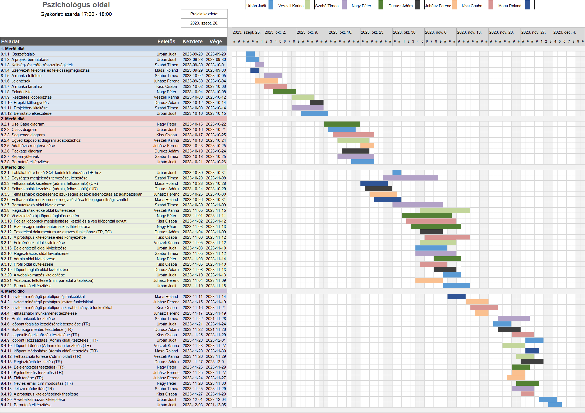

# `Pszichológus oldal` Projektterv `2023/24`

## 1. Összefoglaló 

A projektünk középpontjában egy pszichológus PHD hallgató honlapjának elkészítése áll, aki pszichológiai ismereteket és leckéket   kíván megosztani más pszichológus hallgatókkal, valamint segítséget nyújtani nekik a felzárkózásban és a tanulásban. Az oldal célja, hogy lehetővé tegye a hallgatók számára, hogy könnyen hozzáférjenek az oktatási anyagokhoz és szakmai támogatáshoz.
Az oldalon a pszichológus PHD hallgató bemutatja szakmai hátterét, beleértve a folyamatban lévő PHD tanulmányait, szakmai érdeklődési területeit és kutatási projektjeit. Az oldal segít azon hallgatóknak, akik tovább szeretnék fejleszteni pszichológiai tudásukat, és olyan tanulási forrásokhoz jutni, amelyek segítenek nekik a pályájukon való előrelépésben.
Az oldal különböző pszichológiai leckéket és tanácsokat kínál, hogy segítse a pszichológus hallgatókat a tudásuk bővítésében és a felkészülésben. Emellett segít a pszichológus hallgatóknak megtalálni a számukra legmegfelelőbb oktatási anyagokat és tanácsokat a pszichológia területén.
Az oldal design-ja letisztult és egyszerű, hogy áttekinthető és könnyen navigálható legyen a felhasználók számára. Az oldal elengedhetetlen része egy kapcsolatfelvételi űrlap is, amely lehetővé teszi a felhasználók számára, hogy egyszerűen felvegyék a kapcsolatot a pszichológus PHD hallgatóval, kérdéseket tegyenek fel vagy segítséget kérjenek tőle.


## 2. A projekt bemutatása

Ez a projektterv a Pszichológus munkásságát elősegitő projektet mutatja be, amely 2023-09-23-től 2023-11-22-ig tart, azaz összesen 61 napon keresztül fog futni. A projekten nyolc fejlesztő fog dolgozni, az elvégzett feladatokat pedig négy alkalommal fogjuk prezentálni a megrendelőnek, annak érdekében, hogy biztosítsuk a projekt folyamatos előrehaladását.


### 2.1. Rendszerspecifikáció

A megrendelő, fő igénye az, hogy hatékonyan tudja bemutatni magát és munkásságát az online térben, valamint lehetőséget kapjon az időpontok hatékony kezelésére. A felhasználók számára pedig fontos, hogy könnyen megtalálják a pszichológus szolgáltatásait, és egyszerűen tudjanak időpontot foglalni vagy kapcsolatba lépni vele az oldalon keresztül. A rendszer az adminisztratív feladatok egyszerűsítése és a felhasználói élmény javítása mellett segíti a pszichológust abban, hogy sikeresen kommunikáljon az online közönséggel. A projekt fő célja egy olyan weboldal létrehozása, amely lehetővé teszi egy pszichológus számára, hogy hatékonyan mutassa be magát és szolgáltatásait az online térben. A rendszer lehetőséget biztosít a pszichológusnak saját cikkek publikálására, amelyek segítik az információ megosztását és az online jelenlét erősítését. Emellett a felhasználók regisztrálhatnak az oldalon, és a regisztrált felhasználók időpontot is foglalhatnak a pszichológus szolgáltatásaira, így egyszerűsítve az időpontok koordinálását. Az adminisztrátori felület segítségével könnyen kezelheti a megrendelő az oldal tartalmát és az időpontok elérhetőségét.


### 2.2. Funkcionális követelmények

 - Időpont foglaláskor email értesítés küldése a felhasználónak és az adminnak
 - Felhasználók kezelése (felhasználó, admin) (CRUD)
 - Felhasználói munkamenet megvalósítása több jogosultsági szinttel
 - Időpont foglalások kezelése (CRUD)
 - Cikkek kezelése (CRUD)
 - Email-es kiértesítés új időpont foglalás esetén az adott személynek és a pszichológusnak

   ##### Látogatói nézet:
   - Bemutatkozó oldal
   - Publikált cikkek oldala
   - Kutatáshoz szükséges teszt oldala (beágyazott teszt)
   - Regisztrációs oldal
   - Bejelentkező oldal
   ##### Regisztrált felhasználói nézet:
   - Látogatói nézetben felsoroltak, kivéve Regisztrációs és Bejelentkező oldal
   - Profil oldal
   - Profil módosítás oldal (személyes adatok, jelszó, profilkép és egyéb adatok módosítása)
   - Időpont foglalás
   - Leckék oldala
   ##### Admin nézet:
   - Időpontok kezelése
   - Leckék oldala (CRUD)
   - Publikált cikkek szerkesztése
   - Kutatáshoz szükséges teszt oldala (beágyazott teszt) módositása

### 2.3. Nem funkcionális követelmények

 - A kliens oldal böngészőfüggetlen legyen
 - Reszponzív megjelenés
 - Az érzékeny adatokat biztonságosan tároljuk
 - A legfrissebb technológiákat használja a rendszer


## 3. Költség- és erőforrás-szükségletek

Az erőforrásigényünk összesen `1260` személynap, átlagosan `20` személynap/fő.

A rendelkezésünkre áll összesen `8 * 70 = 560` pont.


## 4. Szervezeti felépítés és felelősségmegosztás

A projekt megrendelője `Urbán Csilla PHD hallgató`. A `Pszichológus oldal` projektet a projektcsapat fogja végrehajtani, amely jelenleg nyolc fejlesztőből áll. A csapatban található többé és kevésbé tapasztalt webprogramozó is.
 - Urbán Judit      (`<1 év tapasztalat`)
 - Szabó Tímea      (`<1 év tapasztalat`)
 - Nagy Péter       (`<1 év tapasztalat`)
 - Durucz Ádám      (`<1 év tapasztalat`)
 - Veszeli Karina   (`<1 év tapasztalat`)
 - Kiss Csaba       (`<1 év tapasztalat`)
 - Masa Roland      (`<1 év tapasztalat`)
 - Juhász Ferenc    (`3 év tapasztalat `)

```
Itt lehet részletezni pl. a tagok szakmai tapasztalatait, vagy akár a releváns gyakorlati helyeket, munkahelyeket megemlíteni.
```

### 4.1 Projektcsapat

A projekt a következő emberekből áll:

| Név           | Pozíció          |   E-mail cím (stud-os)        |
|---------------|------------------|-------------------------------|
| Urbán Judit   | Projektmenedzser | h165835@stud.u-szeged.hu      |
| Szabó Tímea   | Projektmenedzser      | h164242@stud.u-szeged.hu      |
| Nagy Péter    | Projekt tag      | h879771@stud.u-szeged.hu      |
| Durucz Ádám   | Projekt tag      | h155067@stud.u-szeged.hu      |
| Veszeli Karina| Projekt tag      | h166120@stud.u-szeged.hu      |
| Kiss Csaba    | Projekt tag      | h264781@stud.u-szeged.hu      |
| Masa Roland   | Projekt tag      | h267480@stud.u-szeged.hu      |
| Juhász Ferenc | Projekt tag      | h983413@stud.u-szeged.hu      |

```
Betölthető pozíciók: projektmenedzser, projekt tag.
```

## 5. A munka feltételei

### 5.1. Munkakörnyezet

Munkaállomások: 8 db, Windows 10-es operációs rendszerrel

 - Acer laptop (CPU:  i3-1115G4 , RAM: 4GB, GPU: )
 - HP EliteBook (CPU: i7-3740QM, RAM: 14 GB, GPU: NVIDIA Quadro)
 - Asus Zenbook 14x OLED (CPU: AMD Ryzen 5 5600H, RAM: 16 GB, GPU: AMD Radeon Graphics)
 - MacBook Pro (CPU: Apple M1, RAM: 16 GB, GPU: Apple M1 integrált grafikus processzor)
 - Asus ViVoBook 15 (CPU: Intel(R) Core(TM) i7-1165G7 , RAM: 8 GB, GPU:Intel Iris Xe Graphics)
 - MacBook Pro (CPU: Apple M1, RAM: 16 GB, GPU: Apple M1 integrált grafikus processzor)
 - Asztali gép (CPU: Ryzen 5 5600, RAM: 16 GB, GPU: GTX 1650 Super)
 - Asus TUF Gaming FX505 (CPU: AMD Ryzen 7 3750H with Radeon Vega Mobile Gfx 2.30 GHz , RAM: 8 GB, GPU: GTX 1660 TI)
 

A projekt a következő technológiákat/szoftvereket fogja használni a munka során: 

 - Node.js szerverkörnyezet a webalkalmazás futtatásához
 - PostgreSQL adatbázis adataink tárolásához
 - Express.js webes alkalmazáskeret a szerver oldali fejlesztéshez
 - React JavaScript könyvtár a felhasználói felület készítéséhez
 - npm szoftvercsomag menedzser a projekt függőségeinek kezeléséhez
 - Visual Studio Code IDE fejlesztőkörnyezet
 - Git verziókövető rendszer (GitLab)
 
```
Milyen gépet használnak a projekttagok, milyen operációs rendszeren fejlesztenek, milyen szoftverkörnyezetben, stb.
```

### 5.2. Rizikómenedzsment

| Kockázat                                    | Leírás                                                                                                                                                                                     | Valószínűség | Hatás  |
|---------------------------------------------|--------------------------------------------------------------------------------------------------------------------------------------------------------------------------------------------|--------------|--------|
| Betegség                                  | Súlyosságtól függően hátráltatja vagy bizonyos esetekben teljes mértékben korlátozza a munkavégzőt, így az egész projektre kihatással van. Megoldás: a feladatok átcsoportosítása                         | nagy       | erős |
| Kommunikációs fennakadás a csapattagokkal | A csapattagok között nem elégséges az információ áramlás, nem pontosan, esetleg késve vagy nem egyértelműen tájékoztatjuk egymást. Megoldás: még gyakoribb megbeszélések és ellenőrzések                 | kis        | erős |
| ZH időszak                                | A csapattagok közül egy vagy több embernek is húzos hete van, amikor nem tud olyan szinten részt venni a projektben, mint egyébként. Megoldás: ha pár órát is, de igyekszünk foglalkozni a feladattal | nagy        | közepes |
| Internet kimaradás                        | A csapaton belül lehetnek olyanok, akiknél gyakoribb az internet kimaradása. Megoldás: nagyobb kimaradás esetén publikus internettel rendelkező helyen dolgozunk                                          | kis        | elhanyagolható |
| Egymás munkájának felülírása                        | A csapaton belül ha egyeztetés nélkül commitol egyszerre két ember például a projekttervbe, valamelyikőjük munkája elveszhet. Megoldás: kommunikációs felületen egyeztetés.                                         | nagy        | közepes |
| Eltérés a terv és az elvégzett munka között                       | Ha valaki előre dolgozik, és időközben megváltozik a projektterv valamely részlete, a végzett munkája fölöslegessé válhat. Megoldás: Folyamatos kommunikáció, illetve a projektterv folyamatos követése, az előredolgozás. elkerülése                                      | kicsi        | közepes |
| Utazás/Távollét                     | Ha valaki elutazik és nem tartózkodik a számítógépe közelében, elképzelhető, hogy egy mérföldkő határidejéig nem ér vissza, hogy elvégezze a munkáját. Megoldás: Előre tisztázni a tervezett távollétek időpontját, hogy a csapattagok ideiglenesen átvehessék az illető.feladatait.                                      | kicsi        | kicsi |
| Hardvercsere                  | Abban az esetben, ha valaki a projektmunka ideje alatt cserél készüléket, lelassulhat a fejlesztés. Megoldás: Csere előtt ismertetni a szándékot, hogy a csapattagok ennek tudatában oszthassák be idejüket.                                      | kicsi        | kicsi |
| Karantén                  | Nem lehetséges a személyes kommunikáció. Megoldás: Telefon- illetve videóhívásokon keresztüli csoportgyűlések.                                 | kicsi        | erős |
| Fejlesztői környezet problémái                  | A fejlesztői eszközök vagy környezet hibái miatt a fejlesztés leállhat. Megoldás: Alternatív fejlesztői környezetek kialakítása.                                 | kicsi        | kicsi |
| Licencproblémák                 | Egyes használt szoftverek vagy kódok licencelési problémákat okozhatnak. Megoldás: Alapos áttekintés és az összeférhetetlen licencű szoftverek kizárása.                                 | kicsi        | kicsi |
| Időegyeztetési problémák| Egyes tagoknak összeegyeztethetelen a naptára a többi csoporttag időbeosztásával. Megoldás: Szöveges formájú vagy online kommunikáció, jegyzetek készítése.   | közepes | kicsi |
| Csapattagok elhagyása| Egyes csapattagok esetleg kiesnek a projektből az egyetemi kötelezettségeik vagy más okok miatt. Megoldás: Rugalmas tervezés, az elfoglalt diákok beosztásának figyelembevétele.   | kicsi | erős |
| Félresikerült meeting alkoholfogyasztás miatt| Egy meeting alkalmával a csapattagok túlzottan alkoholt fogyasztanak, ami negatívan befolyásolja a munka hatékonyságát és a csapatmunkát. Megoldás: Szigorúan meghatározott viselkedési szabályok, alkoholfogyasztás tilalma a hivatalos megbeszéléseken, és alternatív találkozóhelyek kiválasztása.   | kicsi | közepes |

```
A rizikótényezők bemutatása, amely hátráltathatja a projekt befejezését. 
Minden rizikót érdemes megemlíteni, részletezve, hogy mit jelent, 
milyen valószínűséggel következhet be (kis, közepes és nagy), 
mekkora a várható hatása (gyenge, közepes és erős) 
és hogy milyen tervvel készültök, amennyiben egy ilyen esemény bekövetkezik. 
Pl.: betegség, szoftver-hardver probléma, tag kiesése, extrém ZH időszak, pandémia, stb. 
```

## 6. Jelentések

### 6.1. Munka menedzsment
A munkát `Urbán Judit` és `Szabó Tímea` koordinálja. Fő feladatuk, hogy folyamatosan egyeztessenek a csapattagokkal az előrehaladásról és a fellépő problémákról. További feladatuk a heti szinten tartandó csoportgyűlések időpontjának és helyszínének leszervezése, erről messenger csoportban diskurálnak a projektcsapattal.

```
Írd le, hogy ki menedzseli a munkát (tipikusan a projekt menedzser), mik a feladatai, és azokat hogyan hajtja végre.
```

### 6.2. Csoportgyűlések

A csapat rendszeresen összeül, hogy elősegítse a projekt haladását és biztosítsa a gördülékeny kommunikációt. Az üléseken áttekintik az elmúlt hét kihívásait és megtervezik a következő heti feladatokat, melyről minden alkalommal készül egy rövid memó.

##### 1. megbeszélés:
 - Időpont: 2021.10.05.
 - Hely: Nyugi Kert - Szeged, Vitéz u. 28.
 - Résztvevők: Urbán Judit, Veszeli Karina, Szabó Tímea, Nagy Péter, Durucz Ádám, Juhász Ferenc, Kiss Csaba, Masa Roland
 - Érintett témák: Ismerkedés, projekttéma kiválasztása, főbb feladatok meghatározása
 - Tartalma: A megbeszélés elején lehetőséget biztosítottunk minden résztvevő számára, hogy bemutatkozzon és ismertesse saját háttértudását, mely a projekt során hasznosítható. Ezt követően konszenzus alapján meghatároztuk a megvalósítandó programot, valamint nagyvonalakban körvonalaztuk annak specifikációját és a követelményeket. Ezenfelül rögzítettük a projekt során elvégzendő főbb feladatokat, és tisztáztuk, kik vesznek részt az egyes fázisokban.

##### 2. megbeszélés:
 - Időpont: 2021.10.12.
 - Hely: Nyugi Kert - Szeged, Vitéz u. 28.
 - Résztvevők: Urbán Judit, Veszeli Karina, Szabó Tímea, Nagy Péter, Durucz Ádám, Juhász Ferenc, Kiss Csaba, Masa Roland, Megrendelő
 - Érintett témák: A program követelményeinek egyeztetése és az ügyfél elvárásainak mélyebb megismerése.
 - Tartalma: Az ügyfelet, akinek a szoftvert fejlesztjük, meghívtuk a megbeszélésre, hogy tisztázzuk elvárásait és igényeit. Az egyeztetés során körvonalaztuk a program kulcsfontosságú funkcióit, mint az adminisztrációs felület, a tananyagokkal rendelkező oldal és a "Rólunk" szekció. A tárgyalás végén közös megállapodásra jutottunk a megrendelővel, hogy a szoftver megfeleljen a kurzus előírásainak is.

##### 3. megbeszélés:
- Időpont: 2021.10.19.
 - Hely: Nyugi Kert - Szeged, Vitéz u. 28.
 - Résztvevők: Urbán Judit, Veszeli Karina, Szabó Tímea, Nagy Péter, Durucz Ádám, Juhász Ferenc, Kiss Csaba, Masa Roland
 - Érintett témák: A projektterv átnézése
 - Tartalma: A projekttervet áttekintettük és megvitattuk, hogy hogyan prezentáljuk majd az órán.

##### 4. megbeszélés:
- Időpont: 2021.10.26.
 - Hely: Pivo- Szeged, Vitéz u. 26.
 - Résztvevők: Urbán Judit, Veszeli Karina, Szabó Tímea, Nagy Péter, Durucz Ádám, Juhász Ferenc, Kiss Csaba, Masa Roland
 - Érintett témák: A projektterv átnézése, következő mérföldkő felmérése
 - Tartalma: A projekttervet áttekintettük, mivel sikerült elkészülni, mi van még hátra.

##### 5. megbeszélés:
- Időpont: 2021.11.06.
 - Hely: Pivo- Szeged, Vitéz u. 26.
 - Résztvevők: Urbán Judit, Veszeli Karina, Szabó Tímea, Nagy Péter, Durucz Ádám, Juhász Ferenc, Kiss Csaba, Masa Roland
 - Érintett témák: A projektterv átnézése, következő mérföldkő felmérése
 - Tartalma: A projekttervet áttekintettük, minimumok átnézése leadásig.

##### 6. megbeszélés:
- Időpont: 2021.11.16.
 - Hely: Pivo- Szeged, Vitéz u. 26.
 - Résztvevők: Urbán Judit, Veszeli Karina, Szabó Tímea, Nagy Péter, Durucz Ádám, Juhász Ferenc, Kiss Csaba, Masa Roland
 - Érintett témák: A projektterv átnézése
 - Tartalma: Leadott fájlok, esetleges javitás, személyenkénti minimumok.

### 6.3. Minőségbiztosítás

Az elkészült terveket a terveken nem dolgozó csapattársak közül átnézik, hogy megfelel-e a specifikációnak és az egyes diagramtípusok összhangban vannak-e egymással. A meglévő rendszerünk helyes működését a prototípusok bemutatása előtt a tesztelési dokumentumban leírtak végrehajtása alapján ellenőrizzük és összevetjük a specifikációval, hogy az elvárt eredményt kapjuk-e. További tesztelési lehetőségek: unit tesztek írása az egyes modulokhoz vagy a kód közös átnézése (code review) egy, a vizsgált modul programozásában nem résztvevő csapattaggal. Szoftverünk minőségét a végső leadás előtt javítani kell a rendszerünkre lefuttatott kódelemzés során kapott metrikaértékek és szabálysértések figyelembevételével.
Az alábbi lehetőségek vannak a szoftver megfelelő minőségének biztosítására:
- Specifikáció és tervek átnézése (kötelező)
- Teszttervek végrehajtása (kötelező)
- Unit tesztek írása (választható)
- Kód átnézése (választható)

### 6.4. Átadás, eredmények elfogadása

A projekt eredményeit a gyakorlatvezető, `Dr. Pflanzner Tamás` fogja elfogadni. A projektterven változásokat csak a gyakorlatvezető írásos engedélyével lehet tenni. A projekt eredményesnek bizonyul, ha specifikáció helyes és határidőn belül készül el. Az esetleges késések pontlevonást eredményeznek. 
Az elfogadás feltételeire és beadás formájára vonatkozó részletes leírás a következő honlapon olvasható: https://okt.inf.szte.hu/rf1/

### 6.5. Státuszjelentés

Minden mérföldkő leadásnál a projekten dolgozók jelentést tesznek a mérföldkőben végzett munkájukról a a megadott sablon alapján. A gyakorlatvezetővel folytatott csapatmegbeszéléseken a csapat áttekintik és felmérik az eredményeket és teendőket. Továbbá gazdálkodnak az erőforrásokkal és szükség esetén a megrendelővel egyeztetnek a projektterv módosításáról.

## 7. A munka tartalma

### 7.1. Tervezett szoftverfolyamat modell és architektúra

A pszichológus weboldal fejlesztése során az "agilis fejlesztési modellt" választottuk, mivel ennek a módszertannak előnyei segítenek a folyamatos fejlesztésben és az ügyfél igényeinek való megfelelésben. Az agilis megközelítés lehetővé teszi a projekt rugalmas módosítását és a gyors reagálást az új elvárásokra. Az agilis módszerrel rendszeresen kommunikálunk az ügyféllel, hogy biztosítsuk az igényeik megértését és a folyamatos visszajelzések beépítését a fejlesztésbe.

A webalkalmazás elkészítéséhez a "Model-View-Controller (MVC)" architektúrát alkalmazzuk. Ebben az architektúrában a szerver- és kliensoldal függetlenek egymástól, és csak API végpontok segítségével kommunikálnak egymással. Ez a megközelítés lehetővé teszi a funkcionalitás jól elkülönített és moduláris felépítését, amely segít a fejlesztőknek hatékonyan dolgozni a projekt különböző részein.

Az MVC struktúrában a "Model" rész tartalmazza az alkalmazás üzleti logikáját és az adatkezelést. A "View" rész felelős a felhasználói felület megjelenítéséért, míg a "Controller" rész irányítja a kérések feldolgozását és az adatok továbbítását a megfelelő helyre.

Ezenkívül a rugalmas specifikációk és az agilis fejlesztési megközelítés segít abban, hogy könnyen alkalmazkodjunk az új elvárásokhoz és a vevői visszajelzésekhez a pszichológus weboldal projektjének keretében.

```
Milyen szoftverfolyamat modellt követve állítja elő a csapat a specifikációnak megfelelő prototípusokat? Miért ezt választja? 
A csapat milyen architektúrát választ a projekt megvalósításához? Milyen rétegek (logikai, adat, GUI) lesznek?`
```

### 7.2. Átadandók és határidők

A főbb átadandók és határidők a projekt időtartama alatt a következők:


| Szállítandó |                 Neve                                                        |   Határideje  |
|:-----------:|:---------------------------------------------------------------------------:|:-------------:|
|      D1     |      Projektterv és Gantt diagram, prezentáció, egyéni jelentés             | `2023-10-11`  |
|      D2     |      UML, adatbázis- és képernyőtervek, prezentáció, egyéni jelentés        | `2023-10-25`  |
|    P1+D3    |      Prototípus I. és tesztelési dokumentáció, egyéni jelentés              | `2023-11-15`  |
|    P2+D4    |      Prototípus II. és frissített tesztelési dokumentáció, egyéni jelentés  | `2023-12-06`  |

```
D - dokumentáció, P - prototípus
```

## 8. Feladatlista

A következőkben a tervezett feladatok részletes összefoglalása található.

### 8.1. Projektterv (1. mérföldkő)

Ennek a feladatnak az a célja, hogy `megvalósításhoz szükséges lépéseket, az erőforrásigényeket, az ütemezést, a felelősöket és a feladatok sorrendjét meghatározzuk, majd vizualizáljuk Gantt diagram segítségével.`

Részfeladatai a következők:

#### 8.1.1. Összefoglaló

Felelős: `Urbán Judit`

Tartam:  `2 nap`

Erőforrásigény:  `1 személynap`

#### 8.1.2. A projekt bemutatása

Felelős: `Urbán Judit`

Tartam:  `2 nap`

Erőforrásigény:  `1 személynap`


#### 8.1.3. Költség- és erőforrás-szükségletek

Felelős: `Szabó Tímea`

Tartam:  `2 nap`

Erőforrásigény:  `1 személynap`

#### 8.1.4. Szervezeti felépítés és felelősségmegosztás

#### 8.1.5. A munka feltételei

Felelős: `Szabó Tímea`

Tartam:  ` nap`

Erőforrásigény:  `0.5 személynap`

#### 8.1.6. Jelentések

Felelős: `Juhász Ferenc`

Tartam:  `4 nap`

Erőforrásigény:  `0.5 személynap`

#### 8.1.7. A munka tartalma

Felelős: `Kiss Csaba`

Tartam:  `4 nap`

Erőforrásigény:  `0.5 személynap`

#### 8.1.8. Feladatlista

Felelős: `Nagy Péter`

Tartam:  `4 nap`

Erőforrásigény:  `1 személynap`

#### 8.1.9. Részletes időbeosztás

Felelős: `Veszeli Karina`

Tartam:  `5 nap`

Erőforrásigény:  `0.5 személynap`

#### 8.1.10. Projekt költségvetés

Felelős: `Durucz Ádám`

Tartam:  `3 nap`

Erőforrásigény:  `0.5 személynap`

#### 8.1.11. Projektterv kitöltése

Felelős: `Szabó Tímea`

Tartam:  `7 nap`

Erőforrásigény:  `2 személynap`

#### 8.1.12. Bemutató elkészítése

Felelős: `Urbán Judit`

Tartam:  `5 nap`

Erőforrásigény:  `1 személynap`

### 8.2. UML és adatbázis- és képernyőtervek (2. mérföldkő)

Ennek a feladatnak az a célja, hogy `a rendszerarchitektúrát, az adatbázist és webalkalmazás kinézetét megtervezzük.`

Részfeladatai a következők:

#### 8.2.1. Use Case diagram

Felelős: `Nagy Péter`

Tartam:  `6 nap`

Erőforrásigény:  `2 személynap`

#### 8.2.2. Class diagram

Felelős: `Urbán Judit`

Tartam:  `5 nap`

Erőforrásigény:  `0.5 személynap`

#### 8.2.3. Sequence diagram

Felelős: `Kiss Csaba`

Tartam:  `8 nap`

Erőforrásigény:  `2 személynap`

#### 8.2.4. Egyed-kapcsolat diagram adatbázishoz

Felelős: `Veszeli Karina`

Tartam:  `6 nap`

Erőforrásigény:  `2 személynap`

#### 8.2.5. Adatbázis megtervezése

Felelős: `Juhász Ferenc`

Tartam:  `3 nap`

Erőforrásigény:  `1 személynap`

#### 8.2.6. Package diagram

Felelős: `Durucz Ádám`

Tartam:  `5 nap`

Erőforrásigény:  `0.5 személynap`

#### 8.2.7. Képernyőtervek

Felelős: `Szabó Tímea`

Tartam:  `8 nap`

Erőforrásigény:  `1 személynap`

#### 8.2.8. Bemutató elkészítése

Felelős: `Urbán Judit`

Tartam:  `5 nap`

Erőforrásigény:  `1 személynap`


### 8.3. Prototípus I. (3. mérföldkő)

Ennek a feladatnak az a célja, hogy `egy működő prototípust hozzunk létre, ahol a vállalt funkcionális követelmények nagy része már prezentálható állapotban van.` 

Részfeladatai a következők:

#### 8.3.1. Táblákat létre hozó SQL kódok létrehozása DB-hez

Felelős: `Urbán Judit`

Tartam:  `2 nap`

Erőforrásigény:  `1 személynap`

#### 8.3.2. Moodboard összeállítása, alap dizájn összerakása

Felelős: `Szabó Tímea`

Tartam:  `4 nap`

Erőforrásigény:  `1 személynap`

#### 8.3.3. Felhasználók kezelése (admin, felhasználó) (CR)

Felelős: `Masa Roland`

Tartam:  `6 nap`

Erőforrásigény:  `2 személynap`

#### 8.3.4. Felhasználók kezelése (admin, felhasználó) (UD)

Felelős: `Durucz Ádám`

Tartam:  `6 nap`

Erőforrásigény:  `2 személynap`

#### 8.3.5. Felhasználók kezeléséhez szükséges adatok létrehozása az adatbázisban

Felelős: `Juhász Ferenc`

Tartam:  `5 nap`

Erőforrásigény:  `2.5 személynap`

#### 8.3.6. Felhasználói munkamenet megvalósítása több jogosultsági szinttel

Felelős: `Masa Roland `

Tartam:  `10 nap`

Erőforrásigény:  `3 személynap`

#### 8.3.7. Bemutatkozó oldal kivitelezése

Felelős: `Szabó Tímea`

Tartam:  `10 nap`

Erőforrásigény:  `0.5 személynap`

#### 8.3.8. Regisztráltak lecke oldal kivitelezése

Felelős: `Veszeli Karina`

Tartam:  `10 nap`

Erőforrásigény:  `4 személynap`

#### 8.3.9. Visszajelzés a felhasználónak új időpontfoglalás esetén

Felelős: `Nagy Péter`

Tartam:  `4 nap`

Erőforrásigény:  `1 személynap`

#### 8.3.10. Foglalt időpontok megjelenítése, kezdő és a vég időponttal együtt

Felelős: `Kiss Csaba`

Tartam:  `10 nap`

Erőforrásigény:  `2 személynap`

#### 8.3.11. Biztonsági mentés automatikus létrehozása

Felelős: `Nagy Péter`

Tartam:  `10 nap`

Erőforrásigény:  `3 személynap`

#### 8.3.12. Tesztelési dokumentum az összes funkcióhoz (TP, TC)

Felelős: `Durucz Ádám`

Tartam:  `7 nap`

Erőforrásigény:  `1 személynap/fő`

#### 8.3.13. A prototípus kitelepítése éles környezetbe

Felelős: `Kiss Csaba`

Tartam:  `7 nap`

Erőforrásigény:  `2 személynap`

#### 8.3.14. Felmérések oldal kivitelezése

Felelős: `Veszeli Karina`

Tartam:  `7 nap`

Erőforrásigény:  `3 személynap`

#### 8.3.15. Bejelentkező oldal

Felelős: `Urbán Judit`

Tartam:  `7 nap`

Erőforrásigény:  `1 személynap`

#### 8.3.16. Regisztrációs oldal kivitelezése

Felelős: `Szabó Tímea`

Tartam:  `6 nap`

Erőforrásigény:  `1 személynap`

#### 8.3.17. Admin oldal kivitelezése

Felelős: `Masa Roland`

Tartam:  `14 nap`

Erőforrásigény:  `6 személynap`

#### 8.3.18. Profil oldal kivitelezése

Felelős: `Kiss Csaba`

Tartam:  `5 nap`

Erőforrásigény:  `2 személynap`

#### 8.3.19. Időpont foglaló oldal kivitelezése

Felelős: `Nagy Péter`

Tartam:  `4 nap`

Erőforrásigény:  `2 személynap`

#### 8.3.20. Deploy

Felelős: `Urbán Judit`

Tartam:  `4 nap`

Erőforrásigény:  `0.5 személynap`

#### 8.3.21. Adatbázis feltöltése (min. pár adat a táblákba)

Felelős: `Juhász Ferenc`

Tartam:  `6 nap`

Erőforrásigény:  `1 személynap`


#### 8.3.22. Bemutató elkészítése

Felelős: `Urbán Judit`

Tartam:  `5 nap`

Erőforrásigény:  `1 személynap`


### 8.4. Prototípus II. (4. mérföldkő)

Ennek a feladatnak az a célja, hogy `az előző mérföldkő hiányzó funkcióit pótoljuk, illetve a hibásan működő funkciókat és az esetlegesen felmerülő új funkciókat megvalósítsuk. Továbbá az alkalmazás alapos tesztelése is a mérföldkőben történik az előző mérföldkőben összeállított tesztesetek alapján.`

Részfeladatai a következők:

#### 8.4.1. Javított minőségű prototípus új funkciókkal

Felelős: `Juhász Ferenc`

Tartam:  `4 nap`

Erőforrásigény:  `2 személynap`

#### 8.4.2. Javított minőségű prototípus javított funkciókkal

Felelős: `Juhász Ferenc`

Tartam:  `5 nap`

Erőforrásigény:  `2 személynap`

#### 8.4.3. Javított minőségű prototípus a korábbi hiányzó funkciókkal

Felelős: `Kiss Csaba`

Tartam:  `7 nap`

Erőforrásigény:  `2 személynap`

#### 8.4.4. Felhasználói munkamenet teszteélés

Felelős: `Juhász Ferenc`

Tartam:  `3 nap`

Erőforrásigény:  `2 személynap`

#### 8.4.5. Profil funkciók tesztelése

Felelős: `Szabó Timea`

Tartam:  `7 nap`

Erőforrásigény:  `3 személynap`


#### 8.4.6. Időpont foglalás kezelésének tesztelése (TR)

Felelős: `Nagy Péter`

Tartam:  `5 nap`

Erőforrásigény:  `2 személynap`

#### 8.4.7. Biztonsági mentés tesztelése (TR)

Felelős: `Durucz Ádám`

Tartam:  `5 nap`

Erőforrásigény:  `0.5 személynap`


#### 8.4.8. Jogosultságellenőrzés tesztelése

Felelős: `Kiss Csaba`

Tartam:  `2 nap`

Erőforrásigény:  `2 személynap`

#### 8.4.9. Időpont Hozzáadása tesztelés (TR)

Felelős: `Urbán Judit`

Tartam:  `2 nap`

Erőforrásigény:  `1 személynap`

#### 8.4.10. Időpont törlése tesztelés (TR)

Felelős: `Veszeli Karina`

Tartam:  `7 nap`

Erőforrásigény:  `3 személynap`

#### 8.4.11. Időpont Módositása tesztelés (TR)

Felelős: `Masa Roland`

Tartam:  `2 nap`

Erőforrásigény:  `1 személynap`

#### 8.4.12. Felhasználó törlése (Admin oldal) (TR)

Felelős: `Juhász Ferenc`

Tartam:  `3 nap`

Erőforrásigény:  `1 személynap`

#### 8.4.13. Regisztráció tesztelés (TR)

Felelős: `Durucz Ádám`

Tartam:  `2 nap`

Erőforrásigény:  `1 személynap`

#### 8.4.14. Bejelentkezés tesztelés (TR)

Felelős: `Nagy Péter`

Tartam:  `2 nap`

Erőforrásigény:  `1 személynap`

#### 8.4.15. Kijelentkezés tesztelés (TR)

Felelős: `Juhász Ferenc`

Tartam:  `3 nap`

Erőforrásigény:  `1 személynap`


#### 8.4.16. Fiók törlése (TR)

Felelős: `Veszeli Karina`

Tartam:  `4 nap`

Erőforrásigény:  `1 személynap`

#### 8.4.17. Név és email-cím módosítás (TR)

Felelős: `Nagy Péter`

Tartam:  `2 nap`

Erőforrásigény:  `1 személynap`

#### 8.4.18. Jelszó módosítás(TR)

Felelős: `Szabó Timea`

Tartam:  `4 nap`

Erőforrásigény:  `1 személynap`

#### 8.4.19. Prototípus kitelepítésének frissítése

Felelős: `Kiss Csaba`

Tartam:  `4 nap`

Erőforrásigény:  `1 személynap`

#### 8.4.20. A webalkalmazás kitelepítése

Felelős: `Urbán Judit`

Tartam:  `4 nap`

Erőforrásigény:  `1 személynap`


```
Működő végleges program, a frissített tesztelési dokumentációval. A 3. mérföldkőhöz képest funkiconálisan többet kell tudnia az oldalnak.

```
## 9. Részletes időbeosztás



```
Ide kell berakni a Gantt diagramot, amely a 9. fejezetben található részfeladatokat tartalmazza felelős/tartam bontásban.
```

## 10. Projekt költségvetés

```
Az egyes leadások alkalmával rögzített erőforrásigényt, az elvállalt feladatok számát 
és az adott mérföldkőben végzett munkáért szerezhető pontszámot kell beírni minden emberre külön-külön.
Figyeljünk arra, hogy mivel mindenkinek minden mérföldkövön dolgoznia kell, ezért a 10.3-as táblázat
minden módosítható oszlopában legalább 1 pontnak szerepelni kell.
```

### 10.1. Részletes erőforrásigény (személynap)


| Név           |   M1  |   M2  |   M3 |   M4  | Összesen |
|---------------|-------|-------|------|-------|----------|
| Nagy Péter    | `3`   | `6`   | `16` | `5`   | `30`     |
| Szabó Tímea   | `4`   | `6`   | `16` | `5`   | `31`     |
| Durucz Ádám   | `2`   | `10`  | `10` | `10`  | `32`     |
| Urbán Judit   | `7`   | `6`   | `9`  | `10`  | `32`     |
| Veszeli Karina| `2`   | `5`   | `20` | `4`   | `31`     |
| Juhász Ferenc | `2`   | `3`   | `16` | `9`   | `30`     |
| Kiss Csaba    | `2`   | `3`   | `17` | `9`   | `31`     |
| Masa Roland   | `2`   | `3`   | `17` | `8`   | `30`     |


### 10.2. Részletes feladatszámok

| Név           |   M1  |   M2  |   M3 |   M4 | Összesen |
|---------------|-------|-------|------|------|----------|
| Nagy Péter    | `1`   | `1`   | `3`  | `3`  | `8`      |
| Szabó Tímea   | `3`   | `1`   | `3`  | `2`  | `9`      |
| Durucz Ádám   | `1`   | `1`   | `2`  | `3`  | `7`      |
| Urbán Judit   | `2`   | `1`   | `3`  | `2`  | `8`      |
| Veszeli Karina| `1`   | `1`   | `2`  | `2`  | `6`      |
| Juhász Ferenc | `1`   | `1`   | `2`  | `5`  | `9`      |
| Kiss Csaba    | `1`   | `1`   | `3`  | `3`  | `8`      |
| Masa Roland   | `1`   | `0`   | `2`  | `1`  | `4`      |

### 10.3. Részletes költségvetés

| Név                                 | M1      | M2       | M3       | M4       | Összesen  |
|-------------------------------------|---------|----------|----------|----------|-----------|
| Maximálisan megszerezhető pontszám  |  (7)    | (20)     | (35)     |  (28)    | 100% (70) |
| Nagy Péter                          | `6`     | `16`     | `30`     |  `18`    | 70        |
| Szabó Tímea                         | `6`     | `15`     | `35`     |  `14`    | 70        |
| Durucz Ádám                         | `6`     | `20`     | `24`     |  `20`    | 70        |
| Urbán Judit                         | `7`     | `16`     | `27`     |  `20`    | 70        |
| Veszeli Karina                      | `6`     | `13`     | `35`     |  `16`    | 70        |
| Juhász Ferenc                       | `5`     | `10`     | `27`     |  `28`    | 70        |
| Kiss Csaba                          | `5`     | `10`     | `31`     |  `24`    | 70        |
| Masa Roland                         | `5`     | `10`     | `35`     |  `20`    | 70        |

Szeged, `2023-10-09`.
